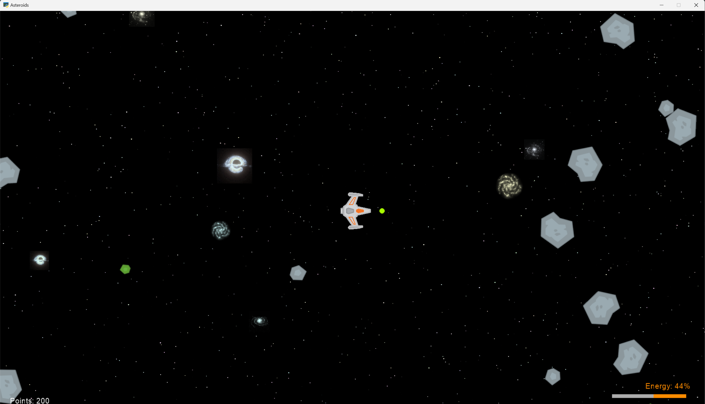

# Asteroids Game



My version of the classic Asteroids game created using Python and the Arcade and Pygame libraries.

## Table of Contents
- [Introduction](#introduction)
- [Features](#features)
- [Getting Started](#getting-started)
- [Installation](#installation)
- [Usage](#usage)
- [Game Controls](#game-controls)
- [Gameplay](#gameplay)
- [Sound](#sound)
- [Contributing](#contributing)
- [License](#license)


## Introduction
This project is my version of the classic Asteroids game in Python. It offers an engaging gaming experience where players control a spaceship to navigate through space, shoot asteroids, and collect energy to survive. The game includes features such as sound effects, a scoring system, and a dynamic starry background.


## Features
Certainly, here's the content with the explanations moved to a different line and indented:

- **Modularity and Organization:**
  - Well-organized code into different folders and files, with a clear class and function structure.

- **Descriptive Names:**
  - Clear and convention-following variable and function names.

- **Comments and Docstrings:**
  - Code documentation with comments and PEP 257-compliant docstrings.

- **Object-Oriented Programming (OOP):**
  - Effective use of OOP principles, encapsulating behavior in classes.

- **Use of Constants:**
  - Centralized constants in a separate module for improved readability and adjustment.

- **Sound Handling:**
  - Efficient sound management using Pygame's mixer module and 7 different tracks.

- **Game Loop:**
  - Structure adheres to a typical game loop with rendering and logic separation.

- **Input Handling:**
  - Effective keyboard input management for key presses and releases.

- **Resource Loading and Handling:**
  - Game resources like textures are loaded efficiently. Star objects are loaded as sprite objects for improved performance while creating a subtle parallax effect.

- **Clean-Up Logic:**
  - Logic for removing inactive objects, and improving memory management.

- **Scalability and Extensibility:**
  - Code structure allows for easy addition of new features.

- **Initialization and Reset Logic:**
  - Methods for initializing and resetting game state.


## Getting Started
To play the game, follow the installation instructions below. Make sure you have Python and the required libraries installed on your system.


## Installation
1. Clone the repository to your local machine:

   ```shell
   git clone https://github.com/shelemhg/asteroids.git
   cd asteroids
2. Install the required dependencies using pip:
   ```shell
   pip install -r requirements.txt

   
## Usage
Run the game by executing the `game.py` file:
  `python game.py`


## Game Controls
- **Up Arrow**: Accelerate forward.
- **Down Arrow**: Reverse thrust.
- **Left Arrow**: Rotate the ship counterclockwise.
- **Right Arrow**: Rotate the ship clockwise.
- **Spacebar**: Fire bullets.
- **Enter**: Restart the game.
- **Escape**: Return to the main menu.


## Gameplay
- Control the spaceship using the arrow keys to navigate through space.
- Shoot asteroids by pressing the Spacebar while managing your energy.
- Collect energy from the small green asteroids to replenish your energy bar.
- Avoid colliding with any other asteroids.
- The game ends when your ship is destroyed (you can restart by pressing Enter) or by destroying and collecting all the asteroids.


## Sound
The game features immersive sound effects, including:
- Engine sounds for ship thrust and reverse thrust.
- Laser sounds when firing bullets.
- Explosions when asteroids are destroyed.
- Energy increase sound when collecting energy.


## Contributing
- Contributions to this project are welcome. Feel free to open issues or submit pull requests for bug fixes, improvements, or new features.
- The original code was a simple base project by: Br. Burton "Designed to be completed by others" and it had 126 lines of code, and it only showed a black window.
Currently, this code contains more than 600 lines on its main game file. Not counting any of the other 7 class files, for an approximate 1100 lines in total, with 791 lines of pure code and 366 lines of useful documentation.


## License
This project is licensed under the [Creative Commons Attribution-NonCommercial 4.0 International License (CC BY-NC 4.0)](https://creativecommons.org/licenses/by-nc/4.0/).
